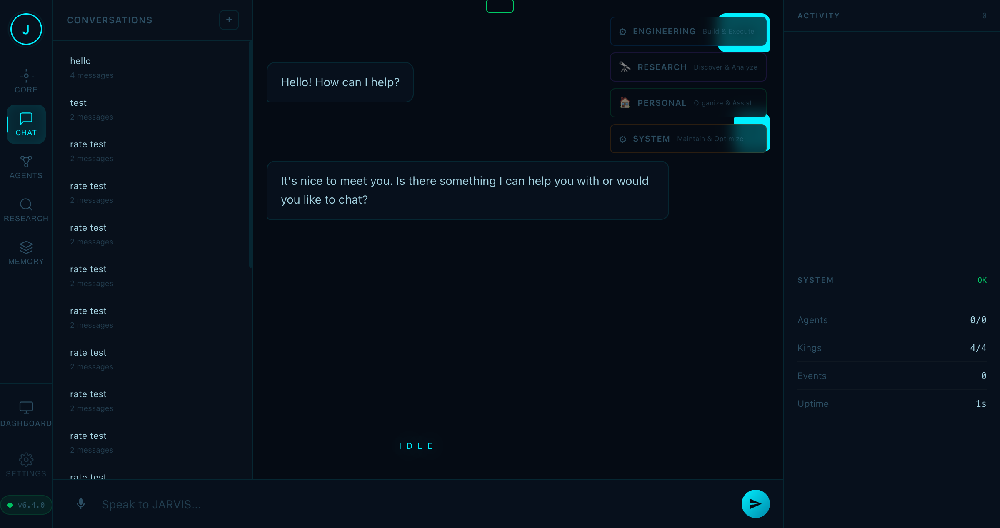

# JARVIS v6.4.0

Multi-Agent AI Operating System inspired by Iron Man's JARVIS.



---

## What Is JARVIS?

JARVIS is a local-first, multi-agent AI system with 23 specialized agents organized into 4 divisions (Kings), each with their own domain of expertise. It features a real-time web dashboard, persistent memory, voice I/O, and a full API.

---

## Quick Start

### Prerequisites

- **Python 3.11+** (tested on 3.9.6+)
- **NVIDIA API Key** (free tier available at [build.nvidia.com](https://build.nvidia.com))

### 1. Clone & Install

```bash
git clone https://github.com/brianbcyang27-prog/poker-assistance.git
cd poker-assistance
pip install -e .
```

For voice support (optional):
```bash
pip install -e ".[voice]"
```

### 2. Configure

```bash
cp .env.example .env
```

Edit `.env` and set your API key:
```
NVIDIA_API_KEY=nvapi-your-key-here
```

### 3. Start the Server

```bash
python run.py
```

Or equivalently:
```bash
python -m jarvis.web.main
```

The server starts on **http://127.0.0.1:8000** by default.

You'll see startup diagnostics:
```
  ✓ port: Port 8000 is available
  ✓ database: SQLite database responsive
  ✓ llm: LLM API reachable (meta/llama-3.1-8b-instruct)
  ✓ agents: 4 kings, 23 workers
  ✓ disk: 57.1 GB free
  ✓ api_key: NVIDIA API key configured
  ✓ JARVIS v6.4.0 ready (4.5s)
```

### 4. Open the Dashboard

Navigate to **http://127.0.0.1:8000** in your browser.

---

## CLI Usage

```bash
# Install the CLI
pip install -e .

# Run the CLI
jarvis
# or
python -m jarvis.cli
```

---

## Configuration

All configuration is via environment variables in `.env`:

| Variable | Default | Description |
|----------|---------|-------------|
| `NVIDIA_API_KEY` | *(required)* | NVIDIA API key for LLM |
| `NVIDIA_MODEL` | `meta/llama-8b-instruct` | LLM model to use |
| `NVIDIA_API_BASE` | `https://integrate.api.nvidia.com/v1` | NVIDIA API endpoint |
| `HOST` | `127.0.0.1` | Server bind address |
| `PORT` | `8000` | Server port |
| `DB_PATH` | `jarvis.db` | SQLite database path |
| `TTS_ENABLED` | `true` | Enable text-to-speech |
| `TTS_PROVIDER` | `macos` | TTS provider: `macos`, `kokoro`, `openai` |
| `STT_ENABLED` | `true` | Enable speech-to-text |
| `LLM_TEMPERATURE` | `0.7` | LLM temperature |
| `MAX_TOKENS` | `4096` | Max tokens per response |
| `REQUIRE_CONFIRMATION` | `true` | Require confirmation for dangerous commands |

Full list: see [`.env.example`](.env.example)

---

## Architecture

```
JARVIS (Chief Executive AI)
    │
    ├── ♠ King (Engineering) — Build & Execute
    │   ├── ♠Q Architect
    │   ├── ♠J Backend
    │   ├── ♠10 Frontend
    │   ├── ♠9 React
    │   ├── ♠8 Python
    │   ├── ♠7 Testing
    │   ├── ♠6 Docs
    │   └── ♠5 A11y
    │
    ├── ♥ King (Personal) — Organize & Assist
    │   ├── ♥Q Calendar
    │   ├── ♥J Email
    │   ├── ♥10 Tasks
    │   └── ♥9 Scheduling
    │
    ├── ♦ King (Research) — Discover & Analyze
    │   ├── ♦Q Web Research
    │   ├── ♦J Documentation
    │   └── ♦10 Fact Check
    │
    └── ♣ King (System) — Maintain & Optimize
        ├── ♣Q Files
        ├── ♣J Terminal
        └── ♣10 Applications
```

---

## Project Structure

```
jarvis/
├── core/               # Config, database, models, events, diagnostics
├── brain/              # LLM integration, memory, skills, DAG planner
│   ├── memory/         # Episodic, personal, journal, working memory
│   ├── llm.py          # LLM interface
│   ├── rag.py          # RAG engine
│   ├── aci.py          # Agent communication
│   └── ...
├── agents/             # Agent hierarchy (kings & workers)
│   ├── kings/          # Division managers
│   └── workers/        # Specialized executors
├── workspace/          # Mission tracking
├── voice/              # Speech I/O (TTS/STT)
├── safety/             # Validation & guardrails
├── web/                # FastAPI server + web UI
│   ├── main.py         # App factory & lifespan
│   ├── routers/        # API endpoints
│   ├── templates/      # HTML templates
│   └── static/         # JS/CSS assets
└── cli.py              # CLI entry point
```

---

## API Endpoints

| Endpoint | Description |
|----------|-------------|
| `GET /api/system/health` | System health check |
| `GET /api/agents` | List all agents |
| `GET /api/agents/hierarchy` | Agent hierarchy tree |
| `GET /api/chat` | Chat history |
| `POST /api/chat` | Send a message |
| `GET /api/memory/episodes` | Episodic memory |
| `GET /api/memory/personal` | Personal memory |
| `GET /api/memory/journal` | Daily journal |
| `GET /api/workspace` | Workspace state |
| `GET /api/settings` | Current settings |
| `GET /dashboard` | Admin dashboard |
| `WS /ws` | WebSocket (real-time) |

---

## Web Dashboard

The dashboard has 5 workspaces:

| Workspace | Description |
|-----------|-------------|
| **Core** | Neural core visualization with state indicator |
| **Chat** | Conversational AI interface with conversation history |
| **Agents** | Agent hierarchy map and status |
| **Research** | Web research and fact-checking tools |
| **Memory** | Episodic, personal, and journal memory views |

Additional pages:
- `/dashboard` — Admin dashboard with system metrics
- `/settings` — Configuration interface
- `/command-center` — Standalone command center view

---

## Development

```bash
# Install with dev dependencies
pip install -e ".[dev]"

# Run tests
pytest

# Run specific test files
pytest tests/test_memory.py tests/test_v630.py -v

# Lint
ruff check .

# Format
ruff format .
```

---

## Testing

JARVIS has **1,162 collected tests** across 39 test files.

```bash
# Run all tests (excluding hanging ones)
pytest tests/ \
  --ignore=tests/test_computer.py \
  --ignore=tests/test_brain_core.py \
  --ignore=tests/test_eng_intel.py \
  --ignore=tests/test_refactoring.py \
  --ignore=tests/test_repo_intelligence.py \
  --ignore=tests/test_plugins.py \
  -q
```

Known test issues (Python 3.9 compatibility):
- `test_computer.py` — macOS accessibility APIs hang
- `test_brain_core.py` — Module-level `asyncio.get_event_loop()` deprecated
- `test_plugins.py` — `asyncio.get_event_loop()` in threaded code

---

## v6.4.0 Changelog

### Critical Fixes
- **Database crash on Python 3.9** — Lazy `asyncio.Lock()` initialization prevents module-level crash
- **Memory subsystem restored** — Added `execute()`/`commit()`/`fetchone()`/`fetchall()` proxy methods to `Database` class
- **Frontend initialization fixed** — Corrected DOM references in `index.html`
- **Memory API endpoints working** — `/api/memory/episodic` and `/api/memory/personal` return 200

### Improvements
- Version aligned to v6.4.0 across all files
- Startup error handling — silent `except` blocks now log at DEBUG
- Removed Pydantic v2 deprecation warnings
- Fixed hardcoded paths for portability

### Documentation
- Comprehensive README with startup guide
- `MAINTENANCE_REPORT_v6.4.md` — Full architecture analysis
- `TEST_AUDIT_v6.4.md` — Test suite analysis

---

## License

MIT
