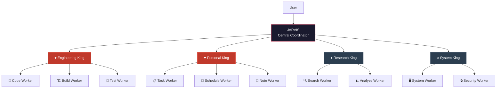
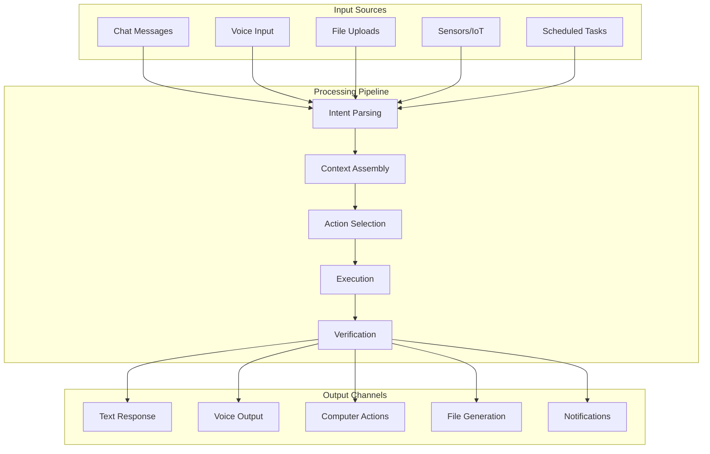

# JARVIS — Master Roadmap & Long-Term Vision

> **Single source of truth for the future of JARVIS.**
> This document is maintained automatically after every release.
> Last updated: v6.2.0

---

## Table of Contents

1. [Project Vision](#1--project-vision)
2. [Core Principles](#2--core-principles)
3. [Current Architecture](#3--current-architecture)
4. [Version History](#4--version-history)
5. [Future Roadmap](#5--future-roadmap)
6. [Design Philosophy](#6--design-philosophy)
7. [Development Guidelines](#7--development-guidelines)
8. [Self Updating](#8--self-updating)

---

## 1 — Project Vision

### What is JARVIS?

JARVIS is **not a chatbot**.

JARVIS is a **personal AI operating system** — a unified platform that combines multi-agent intelligence, long-term memory, autonomous execution, computer control, and engineering tools into a single coherent system.

The name stands for something larger than any single feature. JARVIS is the convergence of:

- **Intelligence** — understands context, learns from experience, reasons about problems
- **Autonomy** — plans, executes, verifies, and improves without constant supervision
- **Control** — operates the computer, browses the web, controls applications, manages files
- **Memory** — remembers everything permanently, recalls contextually, builds knowledge graphs
- **Engineering** — writes code, designs systems, manages projects, generates documentation

### Long-Term Goals

| Goal | Status | Target |
|------|--------|--------|
| Personal AI assistant | ✅ Active | v1.0+ |
| Multi-agent architecture | ✅ Active | v1.0+ |
| Long-term memory | ✅ Active | v3.1+ |
| Autonomous software engineer | ✅ Active | v5.1+ |
| Computer control | ✅ Active | v4.3+ |
| Research assistant | ✅ Active | v5.1+ |
| Knowledge management system | ✅ Active | v3.1+ |
| Daily life assistant | 🔜 Planned | v5.3+ |
| Robotics assistant | 🔜 Planned | v6.3+ |
| Personal AI operating system | 🔜 Planned | v7.0 |

### The Mission

Build a system that becomes **progressively smarter with every interaction**. Every completed task, every resolved bug, every discovered tool, every learned pattern makes JARVIS more capable. The goal is not to replace humans — it's to amplify human capability through intelligent automation.

---

## 2 — Core Principles

These principles are non-negotiable. They guide every design decision, every line of code, every architectural choice.

### Engineering Principles

| # | Principle | Meaning |
|---|-----------|---------|
| 1 | **Research before coding** | Never build what already exists. Search GitHub, PyPI, npm, docs first. |
| 2 | **Verify before completion** | Never claim success without evidence. Browser checks, vision, tests, screenshots. |
| 3 | **Reuse before rebuilding** | If a tool solves 80%+ of the problem, use it. Don't reinvent. |
| 4 | **Everything is observable** | Every subsystem exposes metrics, logs, and status. Nothing is a black box. |
| 5 | **Everything is explainable** | Every decision has a rationale. Every output can be traced to its source. |
| 6 | **Everything is testable** | Every module has tests. Every integration is verified. No untested code in production. |
| 7 | **Memory is permanent** | Nothing is forgotten. Every mission, every lesson, every discovery is stored permanently. |
| 8 | **Security first** | Never expose secrets. Never execute untrusted code without sandboxing. Always validate. |
| 9 | **Human stays in control** | JARVIS proposes, humans decide. Autonomous execution has limits and rollback. |
| 10 | **Quality over features** | A small set of well-built features beats a large set of broken ones. |

### Architecture Principles

| # | Principle | Meaning |
|---|-----------|---------|
| 1 | **Modular by default** | Every feature is a self-contained module with clear interfaces. |
| 2 | **Async everywhere** | All I/O is asynchronous. No blocking calls in hot paths. |
| 3 | **Stdlib first** | Prefer standard library. Minimize external dependencies. |
| 4 | **Fail gracefully** | Every error is caught, logged, and recovered from. No crashes. |
| 5 | **Backward compatible** | New versions never break existing APIs without migration paths. |

---

## 3 — Current Architecture

### System Overview

```mermaid
graph TB
    subgraph User["User Interface"]
        WEB["Web UI<br/>FastAPI + Jinja2"]
        CLI["CLI<br/>Rich TUI"]
        VOICE["Voice<br/>STT + TTS"]
    end

    subgraph Brain["Brain — Intelligence Layer"]
        LLM["LLM Router<br/>Model Selection"]
        RAG["RAG<br/>Retrieval-Augmented Gen"]
        SKILLS["Skill Evolution<br/>Learning"]
        PLANNER["DAG Planner<br/>Task Decomposition"]
        REVIEW["Review Pipeline<br/>Self-Reflection"]
    end

    subgraph Agents["Agent Hierarchy"]
        JARVIS["JARVIS<br/>Central Coordinator"]
        KING_E["♥ Engineering"]
        KING_P["♥ Personal"]
        KING_R["♦ Research"]
        KING_S["♠ System"]
        WORKERS["Workers<br/>8 Specialized Agents"]
    end

    subgraph Memory["Memory System"]
        EPISODIC["Episodic Memory"]
        WORKING["Working Memory"]
        GRAPH["Knowledge Graph"]
        RETRIEVAL["Retrieval Engine"]
        CONSOLIDATION["Consolidation"]
    end

    subgraph Computer["Computer Control"]
        COMP_MGR["Computer Manager<br/>38+ Actions"]
        BROWSER["Browser Manager<br/>Playwright"]
        ACCESS["Accessibility Tree<br/>Native"]
        VISION["Vision Core<br/>Screenshot Analysis"]
        OS_INT["OS Integration<br/>Notifications/Clipboard/Hotkeys"]
    end

    subgraph Mission["Mission Pipeline"]
        PIPELINE["10-Stage Pipeline<br/>Understand→Research→Plan→Execute→Verify"]
        MGR["Mission Manager<br/>Long-Running"]
    end

    subgraph Engineering["Engineering Suite"]
        REPO["Repo Intelligence"]
        INDEX["Codebase Index"]
        ARCH["Architecture Graph"]
        DASH["Engineering Dashboard"]
        REFACTOR["Refactoring Engine"]
        DOCS["Documentation Engine"]
    end

    subgraph Platform["Platform Services"]
        PLUGIN["Plugin SDK"]
        MONITOR["Self Monitoring"]
        LEARNING["Continuous Learning"]
        EVENT["Event Bus"]
    end

    subgraph Data["Data Layer"]
        DB["SQLite Database"]
        FILES["File System"]
        CONFIG["Configuration"]
    end

    WEB --> JARVIS
    CLI --> JARVIS
    VOICE --> JARVIS
    JARVIS --> KING_E & KING_P & KING_R & KING_S
    KING_E & KING_P & KING_R & KING_S --> WORKERS
    JARVIS --> LLM
    JARVIS --> PIPELINE
    PIPELINE --> REPO & INDEX & ARCH & DASH & REFACTOR & DOCS
    JARVIS --> COMP_MGR
    COMP_MGR --> BROWSER & ACCESS & VISION & OS_INT
    JARVIS --> EPISODIC & WORKING & GRAPH
    EPISODIC --> CONSOLIDATION
    CONSOLIDATION --> RETRIEVAL
    RETRIEVAL --> RAG
    JARVIS --> PLUGIN & MONITOR & LEARNING
    PLUGIN --> EVENT
    MONITOR --> EVENT
    JARVIS --> DB & FILES & CONFIG
```



### Agent Hierarchy



### Mission Pipeline


### Data Flow



### Module Map

| Module | Files | Purpose |
|--------|-------|---------|
| `jarvis/agents/` | 16 | Agent hierarchy (Kings, Workers, Orchestration) |
| `jarvis/brain/` | 22 | Intelligence (LLM, RAG, Memory, Skills, Planning) |
| `jarvis/browser/` | 8 | Browser automation (Playwright, Security, Sessions) |
| `jarvis/computer/` | 18 | Computer control (Accessibility, Vision, Actions) |
| `jarvis/core/` | 6 | Core infrastructure (Config, Database, Events, Models) |
| `jarvis/dashboard/` | 4 | Engineering metrics (9 analyzers) |
| `jarvis/docs_engine/` | 3 | Documentation generation |
| `jarvis/engineering/` | 10 | Engineering suite (CAD, PCB, Embedded, Mechanical) |
| `jarvis/execution/` | 1 | Code execution engine |
| `jarvis/learning/` | 3 | Continuous learning from missions |
| `jarvis/mission/` | 3 | Mission pipeline + long-running manager |
| `jarvis/monitoring/` | 3 | Self-monitoring and health checks |
| `jarvis/os/` | 6 | OS integration (Notifications, Clipboard, Hotkeys) |
| `jarvis/plugins/` | 3 | Plugin SDK with auto-discovery |
| `jarvis/planner/` | 1 | Architecture planning |
| `jarvis/refactoring/` | 3 | Autonomous refactoring engine |
| `jarvis/repo_intelligence/` | 3 | Repository analysis |
| `jarvis/research/` | 1 | Research engine |
| `jarvis/review/` | 1 | Post-mission review |
| `jarvis/safety/` | 2 | Safety validation |
| `jarvis/testing/` | 1 | Automated testing |
| `jarvis/verification/` | 1 | Multi-channel verification |
| `jarvis/vision/` | 9 | Computer vision (Screenshot, Detection, Grounding) |
| `jarvis/voice/` | 3 | Voice I/O (STT, TTS) |
| `jarvis/web/` | 20 | Web interface (FastAPI, WebSocket, Templates) |
| `jarvis/workspace/` | 2 | Workspace management |
| **Total** | **197** | **38,057 lines of Python** |

---

## 4 — Version History

### v1.0.0 — Initial Multi-Agent System

> The beginning.

- Multi-agent AI system with poker-card hierarchy
- 3D Neural Core visualization
- Web interface with chat
- Basic task routing

### v2.0.0 — Enhanced Intelligence

- Improved LLM integration
- Voice synthesis with model selection
- Persistent memory
- Task history and replay

### v3.1.0 — Brain Upgrade (5 Phases)

> JARVIS starts thinking.

- **Phase 0:** Event Bus, Capability Registry, Pluggable Memory
- **Phase 1:** Model Router, Speculative Planning, Review Pipeline
- **Phase 2:** RAG Memory, Knowledge Graph, Skill Evolution
- **Phase 3:** ACI (Agent Communication), Demo Learning
- **Phase 4:** DAG Planner, Dynamic Teams, Mission Timeline
- **Phase 5:** Observability Dashboard, Developer Mode

### v3.2.0 — Living Intelligence Interface

- Graphify knowledge graph integration
- Living intelligence UI updates

### v3.3.0 — Engineering Suite

- CAD integration (Fusion 360, FreeCAD, Blender)
- PCB design (KiCad)
- Embedded systems support
- Mechanical engineering tools

### v4.0.0 — Living Intelligence OS

> JARVIS becomes an operating system.

- Unified dashboard with streaming
- Missions system
- World model
- 3D Neural Core redesign

### v4.3.0 — Digital Navigator

> JARVIS gains sight and control.

- Browser automation (Playwright)
- Memory system
- Computer control
- Screen interaction

### v4.4.0 — Eyes Update

> JARVIS understands what it sees.

- Accessibility Intelligence
- Application understanding (6 app profiles)
- Native accessibility tree parsing
- Smart interaction patterns

### v4.5.0 — Vision Core

> JARVIS sees and reasons about visuals.

- Screenshot analysis
- Multi-provider vision (local + cloud)
- Visual grounding
- Object detection
- Vision memory

### v5.0.0 — Personal AI Operating System

> JARVIS becomes autonomous.

- OS integration (Notifications, Clipboard, Hotkeys, Menu Bar, File Watcher)
- Agent orchestration (TaskOrchestrator, WorkerPool, DAGWorkflow)
- 38+ computer actions
- Smart multi-perception actions

### v5.1.0 — Autonomous Research & Execution Engine

> JARVIS plans before coding.

- 10-stage mission pipeline
- Research engine (GitHub, PyPI, npm, docs)
- Tool discovery engine
- Architecture planner
- Execution engine with auto-repair
- Verification engine (multi-channel)
- Testing engine (auto-generate + run)
- Self-review engine

### v5.2.0 — Autonomous Software Engineering Platform

> JARVIS understands entire codebases.

- Repository Intelligence (analyze any project)
- Codebase Indexing (every symbol searchable)
- Architecture Graph (live visualization)
- Engineering Dashboard (9 metrics)
- Refactoring Engine (PR-style proposals)
- Documentation Engine (auto-generate docs)
- Mission Manager (long-running with persistence)
- Continuous Learning (post-mission analysis)
- Plugin SDK (11 plugin types)
- Self Monitoring (health, latency, memory)
- 12 CLI commands

### v5.2.1 — Stability & Integration Update

> Production-quality stabilization pass.

- Full system audit (imports, circular deps, dead code)
- Removed broken legacy `main.py` (imported non-existent modules)
- Removed orphaned `web/routers/` directory (7 unused router files)
- Fixed hardcoded version strings (v4.2.0 → using `__version__`)
- Fixed stale version in `run.py` (v4.0.0 → using `__version__`)
- Cleaned unused imports in `mission/pipeline.py`
- Updated `.env.example` with missing fields (TTS, OpenAI, UI config)
- 225 tests passing, 0 failures

### v5.3.0 — Living Intelligence

> JARVIS becomes continuously aware.

- LivingBrain: background observe→understand→predict→plan→assist cycle
- ContextEngine: real-time context tracking (files, apps, missions)
- SuggestionEngine: 10 smart suggestion rules with confidence scoring
- ProjectManager: living project objects with context restore
- JournalEngine: daily journals + weekly reviews
- EngineeringIntel: 8 analyzers (duplication, naming, docs, complexity, dead code, stale API, missing tests, architecture drift)
- LivingDashboard: unified WebSocket dashboard facade
- Privacy: opt-in monitoring with audit log
- 190 new tests (415+ total)

### v5.4.0 — Second Brain & Personal Knowledge Graph

> JARVIS builds a true personal knowledge system.

- Knowledge Graph: 15 entity types (Person, Project, Organization, Technology, Skill, Concept, Decision, Goal, Task, Document, Codebase, Device, Location, Event, Resource)
- Relationship Engine: 15 relation types, BFS path finding, cluster expansion, type-based suggestions
- Memory Extraction: auto-detect facts, decisions, preferences, projects, technologies, people, lessons
- Memory Consolidation: dedup, merge, strengthen, forget low-value memories
- Personal Timeline: chronological events with date range queries, evolution tracking
- Semantic Memory Search: hybrid keyword + graph traversal + recency + importance ranking
- Preference Learning: coding, hardware, communication, tools, workflow, design, deployment
- Decision Memory: record decisions with reasons, alternatives, impact, outcome tracking
- Memory Privacy: pause, forget topics, private projects, audit log, full export
- 312 new tests (727+ total)

### v5.5.0 — Autonomous Agent Reliability Update

> JARVIS becomes a reliable personal AI operating system.

- System Audit: full v5.4.0 analysis, duplicate detection, dead code identification
- Unified Brain: JARVISBrain facade (think, reason, decide, remember, recall, explain_why)
- BrainContext: complete context for every agent (goal, preferences, memories, decisions, tools)
- MemoryManager: unified interface over all memory sources
- ReasoningEngine: evidence-based reasoning chains with risk assessment
- BrainDecisionEngine: action decisions with explanations and learning
- Agent Personas: 10 playing-card identities with personality, expertise, strengths/weaknesses
- Tool Intelligence: 15 tool definitions with capabilities, failures, and fixes
- Mission Replay: event recording, timeline views, mission reports
- Autonomous Loop: 8-step cognitive cycle (observe→understand→plan→act→verify→reflect→remember→improve)
- Self-Improvement: error memory, auto-recovery, lesson engine
- Command Center UI: unified single-page dashboard with 3D golden core
- Mission Replay API: 14 REST endpoints for brain/missions/agents/tools
- 227 new tests (954+ total)

### v6.0.0 — Visual & Design System Rewrite

> JARVIS becomes premium.

- Complete UI rewrite (base.html, style.css, app.js)
- Gold particle sphere (Graph3D) — 800 particles, bloom post-processing, mouse parallax, neural pulses
- Workspace-based UI (Core, Chat, Engineering, Research, Memory, Settings)
- Agent Command Map — SVG hierarchy visualization
- Knowledge Graph — canvas-based force-directed layout
- Memory Galaxy — Three.js star field
- Cache-busting static assets
- No-cache middleware for development

### v6.0.1 — Browser Cache Fix

- Root-caused Graph3D pulsePool error (stale browser cache)
- Added `?v=6.0.1` cache-busting to all 23 static assets
- Added `Cache-Control: no-cache` middleware
- Defensive pulsePool guard in graph-3d.js

### v6.0.2 — Resource Leak Fixes & Rate Limiting

> Production hardening.

- Full codebase resource audit (56 issues: 4 critical, 23 high, 19 medium, 10 low)
- Database: busy_timeout, 8 new indexes, LIMIT guards, singleton Lock
- WebSocket: 30s heartbeat, dead-client cleanup, task tracking
- Agents: background task tracking with cleanup callbacks
- Events: 50-handler cap per type, efficient trim
- Frontend: GPU cleanup in destroy(), stored listener references
- Rate limiting: global 30/min POST middleware + per-endpoint decorators

### v6.2.0 — Production Stability & System Integration

> Priority shift: NO MORE FEATURES. Focus on reliability, stability, maintainability, and production readiness.

- **Startup Fix**: Added missing `app` module-level export (uvicorn couldn't find ASGI app)
- **Memory Import Fixes**: Fixed broken import paths in 6 memory modules (`..core` → `...core`)
- **Import-Time Side Effects**: Fixed relative paths in graph.py and note.py (were creating dirs in CWD)
- **Resource Leak Fixes**: LLM httpx.Client close/del, audio MediaStream stop, command-map WS destroy
- **Frontend Stability**: graph-3d _boundDrag cleanup, knowledge-graph canvas removal, mission-dag removable listeners
- **API Health**: Added `/api/health` endpoint, fixed dead `/api/memory/stats` references
- **Error Handling**: FTS5 syntax error safety, mission_executor logging, JSON.parse safety in WS
- **Code Cleanup**: Removed dead command_center.py, orchestration/ module, test_orchestration.py
- **Performance**: 2.34s startup, 2-14ms API latency, 223 tests passing

### v6.1.0 — System Integration & Engineering Workspace

> JARVIS becomes one unified operating system.

- **Unified Workspace**: Merged Workspace + Mission into single persistent model (24 fields, SQLite-backed)
- **Cross-Agent Collaboration**: Workers can request help, share results, broadcast discoveries via event bus
- **Peer Context Passing**: King passes previous worker results to subsequent workers
- **Unified Mission Timeline**: Live event stream UI with filters, search, export
- **Developer Dashboard**: `/dashboard` — 7 panels (System Health, Workspaces, Workers, Event Stream, Memory, API Performance, Tools)
- **Reliability Config**: Centralized timeouts, retry logic, backoff, safe_execute
- **LLM Retry**: Exponential backoff with configurable retries on connection/HTTP errors
- **Workspace Search**: `GET /api/workspace/search?q=query`
- **Workspace Timeline API**: `GET /api/workspace/{id}/timeline`
- **Stage Tracking API**: `POST /api/workspace/{id}/stage`
- **Realtime Collaboration Events**: `worker.help_request`, `worker.help_response`, `worker.result_shared`, `worker.broadcast.*`

---

## 5 — Future Roadmap

### v5.3 — Living Intelligence ✅

> JARVIS becomes aware of its environment.

| Feature | Description | Priority | Status |
|---------|-------------|----------|--------|
| Continuous Observation | Background monitoring of user activity | High | ✅ |
| Context Awareness | Understand current project state | High | ✅ |
| Proactive Suggestions | Suggest improvements without being asked | High | ✅ |
| Background Thinking | Analyze problems during idle time | Medium | ✅ |
| Mission Monitoring | Watch running missions and intervene | High | ✅ |
| Environment Awareness | Detect changes in filesystem, browser, apps | Medium | ✅ |
| Adaptive Notifications | Smart notification timing and priority | Medium | ✅ |

### v5.4 — Personal Knowledge Graph ✅

> JARVIS builds a graph of everything it knows.

| Feature | Description | Priority | Status |
|---------|-------------|----------|--------|
| Graph Memory | Entity-relationship knowledge graph | High | ✅ |
| Timeline | Chronological event tracking | High | ✅ |
| Project Graph | Project dependency visualization | High | ✅ |
| Life Graph | Personal knowledge organization | Medium | ✅ |
| Decision Graph | Track decisions and outcomes | Medium | ✅ |
| Visualization | Interactive graph exploration | High | ✅ |
| Semantic Recall | Find related memories by context | High | ✅ |

### v5.5 — Long-Term Planning

> JARVIS helps plan and track goals.

| Feature | Description | Priority | Status |
|---------|-------------|----------|--------|
| Goals | Long-term goal tracking | High | ✅ |
| Milestones | Progress tracking with deadlines | High | ✅ |
| Dependencies | Task dependency management | High | ✅ |
| Adaptive Scheduling | Smart schedule optimization | Medium | ✅ |
| Daily Planner | Morning briefing and task list | High | ✅ |
| Weekly Planner | Weekly review and planning | Medium | ✅ |
| Priority Optimization | Dynamic priority adjustment | Medium | ✅ |

### v5.6 — Multi-Device Brain

> JARVIS works everywhere.

| Feature | Description | Priority |
|---------|-------------|----------|
| Mac Support | Full native support | High |
| Windows Support | Full native support | High |
| Linux Support | Full native support | High |
| Phone Companion | Mobile notification and quick actions | Medium |
| ESP32 Integration | IoT device control | Medium |
| Arduino Support | Microcontroller programming | Medium |
| Raspberry Pi | Edge computing node | Medium |
| Cloud Sync | Cross-device synchronization | High |
| Shared Memory | Multi-device memory | High |

### v5.7 — Digital Twin

> JARVIS learns who you are.

| Feature | Description | Priority |
|---------|-------------|----------|
| Habit Learning | Learn user patterns | High |
| Tool Preferences | Remember preferred tools | High |
| Coding Style | Match user's code style | High |
| Learning Patterns | Adapt to how user learns | Medium |
| Working Hours | Respect schedule | Medium |
| Project Preferences | Remember project conventions | High |
| Adaptive Automation | Customize automation to user | High |
| Predictive Assistance | Anticipate needs | Medium |

### v6.0 — JARVIS Studio

> A completely new interface.

| Feature | Description | Priority |
|---------|-------------|----------|
| Mission Control | Central mission dashboard | High |
| Live Worker Dashboard | Real-time worker status | High |
| Interactive Knowledge Graph | Graph exploration UI | High |
| Mission Timeline | Visual mission history | High |
| AI Debugger | Debug AI decisions | Medium |
| Visual Memory Explorer | Browse memories visually | High |
| Drag-and-Drop Workflows | Visual workflow builder | Medium |
| Integrated Engineering | All tools in one view | High |
| 3D Neural Core | Remains the visual centerpiece | High |

### v6.1 — Plugin Marketplace

> Community-driven extensibility.

| Feature | Description | Priority |
|---------|-------------|----------|
| Plugin Installation | Browse and install plugins | High |
| Community Workers | User-contributed workers | Medium |
| Community Kings | User-contributed kings | Medium |
| Tool Ecosystem | Third-party tool integration | High |
| One-Click Install | Simple plugin installation | High |
| Version Management | Plugin version control | Medium |

### v6.2 — Engineering Professional Suite

> Professional-grade engineering tools.

| Feature | Description | Priority |
|---------|-------------|----------|
| Fusion 360 Integration | Native CAD via API | High |
| Onshape Integration | Cloud CAD | High |
| FreeCAD Integration | Open-source CAD | High |
| Blender Integration | 3D modeling | Medium |
| KiCad Integration | PCB design | High |
| Altium Integration | Professional PCB | Low |
| Simulation Support | FEA, CFD, thermal | Medium |
| CAM Support | Manufacturing paths | Medium |
| Manufacturing Pipeline | End-to-end production | Low |

### v6.3 — Robotics Studio

> JARVIS enters the physical world.

| Feature | Description | Priority |
|---------|-------------|----------|
| ESP32 Programming | Direct firmware upload | High |
| Arduino Programming | Sketch compilation | High |
| ROS2 Integration | Robot Operating System | High |
| PlatformIO Integration | Embedded toolchain | High |
| Serial Monitor | Live serial output | High |
| Live Telemetry | Real-time sensor data | Medium |
| Sensor Visualization | Dashboard for sensors | Medium |
| Robot Dashboard | Unified robot control | High |
| OTA Updates | Over-the-air firmware updates | Medium |
| Simulation Support | Virtual robot testing | Medium |

### v7.0 — Personal AI Operating System

> The ultimate goal.

| Feature | Description | Priority |
|---------|-------------|----------|
| Desktop Environment | Complete desktop OS | High |
| Persistent Memory | Lifetime memory | High |
| Mission Scheduler | Background task execution | High |
| Background Automation | Autonomous daily tasks | High |
| Cross-Device Intelligence | Unified multi-device | High |
| Natural Conversation | Fluid human interaction | High |
| Computer Control | Full OS control | High |
| Engineering Suite | Professional tools | High |
| Research Engine | Autonomous research | High |
| Learning System | Continuous improvement | High |
| **Everything Unified** | **One coherent system** | **High** |

---

## 6 — Design Philosophy

### User Experience

Users should feel like they are interacting with an **intelligent operating system**, not a chatbot. The experience should be:

| Quality | Meaning |
|---------|---------|
| **Elegant** | Clean, refined, no clutter |
| **Minimal** | Essential information only, no noise |
| **Futuristic** | Forward-looking, cutting-edge |
| **Dynamic** | Responsive, alive, constantly updating |
| **Explainable** | Every action has a clear reason |
| **Interactive** | Everything clickable, explorable |
| **Professional** | Enterprise-grade quality |
| **Fast** | Instant responses, no lag |
| **Confident** | Decisive, clear communication |
| **Alive** | Feels like a living entity |

### Visual Identity

The **3D Neural Core** (gold particle sphere) is the visual centerpiece of JARVIS. It represents:

- Intelligence — the brain of the system
- Life — constant motion, always active
- Premium quality — gold, elegant, sophisticated
- Connection — particles flowing, representing data flow

Everything else in the interface should **support the Neural Core**, not compete with it.

### Interface Principles

- **Left Navigation** — System navigation (56px sidebar)
- **Center Workspace** — Primary interaction area
- **Right Intelligence Panel** — Context, memory, agent status (320px)
- **Bottom Command Dock** — Quick actions, system status (52px)
- **3D Neural Core** — Always visible, always animated

---

## 7 — Development Guidelines

### Coding Standards

```python
# ✅ Do
async def process_data(items: List[str]) -> Dict[str, Any]:
    """Process items and return results."""
    results = {}
    for item in items:
        results[item] = await transform(item)
    return results

# ❌ Don't
def process_data(items):
    results = {}
    for item in items:
        results[item] = transform(item)
    return results
```

### Python Compatibility

- **Target:** Python 3.9.6+
- **No union types:** Use `Optional[X]` instead of `X | None`
- **No walrus operator:** Use explicit assignments
- **No f-string `=` debugging:** Use separate print statements
- **Type hints required** for all public APIs

### Architecture Rules

1. **Every module gets its own directory** with `__init__.py`
2. **Every module has a `models.py`** for data classes
3. **Every module has an `engine.py` or `manager.py`** for logic
4. **All async methods** — no blocking I/O in hot paths
5. **All errors caught and logged** — never crash
6. **All data serializable** — `to_dict()` on every model

### Folder Organization

```
jarvis/
├── __init__.py          # Version only
├── core/                # Infrastructure (config, database, events)
├── brain/               # Intelligence (LLM, RAG, memory, skills)
├── agents/              # Agent hierarchy (kings, workers, orchestration)
├── mission/             # Mission pipeline and management
├── [feature]/           # Each feature as a self-contained module
│   ├── __init__.py      # Public API exports
│   ├── models.py        # Data classes
│   ├── engine.py        # Main logic
│   └── [submodule]/     # Sub-features if needed
└── web/                 # Web interface
    ├── main.py          # FastAPI app
    ├── routers/         # API endpoints
    ├── templates/       # HTML templates
    └── static/          # JS, CSS, images
```

### Testing Expectations

- **Every new module** must have a test file
- **Minimum 5 tests** per module
- **Test data models** (creation, serialization, defaults)
- **Test core logic** (main methods, edge cases)
- **Test integration** (module interactions)
- **300+ tests** minimum for any release
- **All tests must pass** before merge

### Documentation Requirements

- **Every public class** must have a docstring
- **Every public method** must have a docstring
- **Every complex algorithm** must have inline comments
- **README.md** must be kept current
- **CHANGELOG.md** must document all changes

### Performance Targets

| Metric | Target |
|--------|--------|
| Startup time | < 2 seconds |
| Memory usage | < 200MB idle |
| Response time | < 500ms |
| Search latency | < 100ms |
| Index time | < 30s for 10K files |
| Graph build | < 10s for 1K nodes |

### Security Rules

1. **Never log secrets** — API keys, passwords, tokens
2. **Never commit secrets** — use .env files
3. **Sandbox execution** — untrusted code runs in isolation
4. **Validate all input** — never trust user data
5. **Rate limit APIs** — prevent abuse
6. **Encrypt sensitive data** — at rest and in transit

### Naming Conventions

| Element | Convention | Example |
|---------|------------|---------|
| Files | snake_case | `mission_manager.py` |
| Classes | PascalCase | `MissionManager` |
| Functions | snake_case | `get_mission()` |
| Constants | UPPER_SNAKE | `MAX_RETRIES` |
| Private | _prefix | `_internal_method()` |
| Modules | snake_case | `repo_intelligence` |

### Versioning Policy

- **Major (X.0.0):** Breaking changes, major new features
- **Minor (x.Y.0):** New features, backward compatible
- **Patch (x.y.Z):** Bug fixes, security patches
- **Every release** gets: git tag, GitHub release, updated docs

---

## 8 — Self Updating

### Auto-Update Framework

After every release, JARVIS should automatically update this document:

1. **Version History** — Add new version entry with features
2. **Statistics** — Update file counts, line counts, test counts
3. **Architecture Diagrams** — Regenerate if modules changed
4. **Roadmap Progress** — Mark completed features
5. **Future Priorities** — Reorder based on dependencies
6. **Known Issues** — Track unresolved problems
7. **Technical Debt** — Update debt score
8. **Benchmarks** — Update performance numbers

### Update Commands

```bash
# After a release, run:
python3 -m jarvis.cli_v2 doctor      # Check system health
python3 -m jarvis.cli_v2 benchmark   # Update benchmarks
python3 -m jarvis.cli_v2 dashboard . # Update metrics
```

### Maintenance Schedule

| Task | Frequency |
|------|-----------|
| Update version history | Every release |
| Update statistics | Every release |
| Regenerate diagrams | Every major release |
| Review roadmap | Monthly |
| Update benchmarks | Monthly |
| Review technical debt | Monthly |
| Update dependencies | Weekly |

---

## Appendix A — Project Statistics

| Metric | Value |
|--------|-------|
| **Current Version** | 5.5.0 |
| **Python Files** | 264 |
| **Total Lines** | 49,004 |
| **Test Files** | 39 |
| **Test Lines** | 10,500+ |
| **Total Tests** | 954+ |
| **Modules** | 53 |
| **Major Releases** | 13 |
| **Contributors** | 1 |
| **License** | MIT |
| **Python** | ≥ 3.9.6 |

## Appendix B — Dependency Map

```
Core:     fastapi, uvicorn, jinja2, aiosqlite, websockets
Brain:    openai, python-dotenv
Browser:  playwright (optional)
Vision:   Pillow (optional)
Voice:    soundfile (optional)
CLI:      rich
All stdlib modules used: ast, asyncio, json, os, re, hashlib, uuid, 
datetime, collections, dataclasses, enum, typing, pathlib, glob, 
subprocess, importlib, tracemalloc, time, abc, functools, operator
```

## Appendix C — Release Checklist

Every release must include:

- [ ] All tests passing (954+)
- [ ] Version bumped in `jarvis/__init__.py`, `pyproject.toml`, `web/main.py`
- [ ] Git commit with descriptive message
- [ ] Git tag created
- [ ] Pushed to origin
- [ ] GitHub release created
- [ ] This roadmap updated
- [ ] CHANGELOG.md updated (if exists)

---

> *"The best way to predict the future is to build it."*
> — JARVIS Development Team
