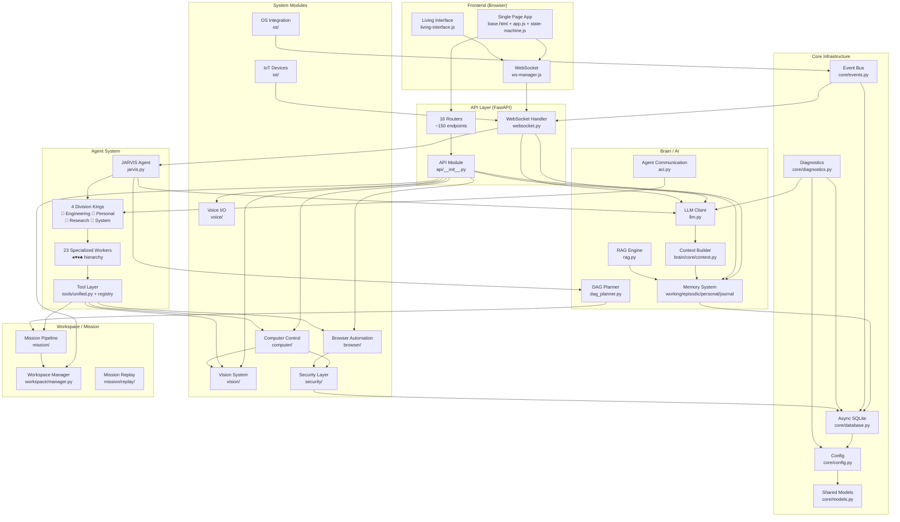
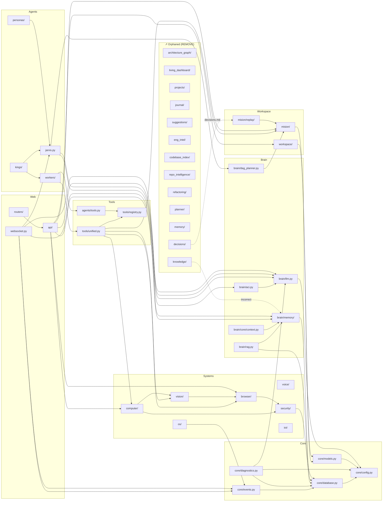
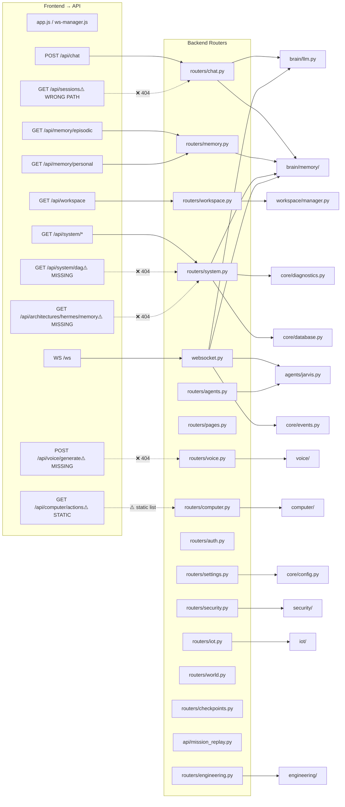
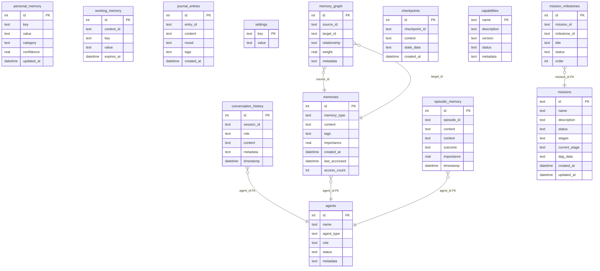
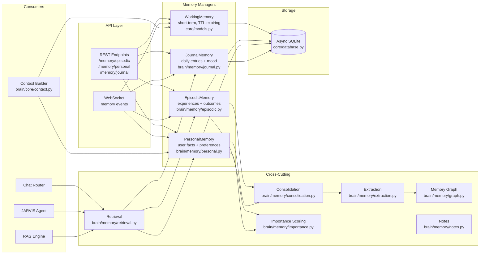
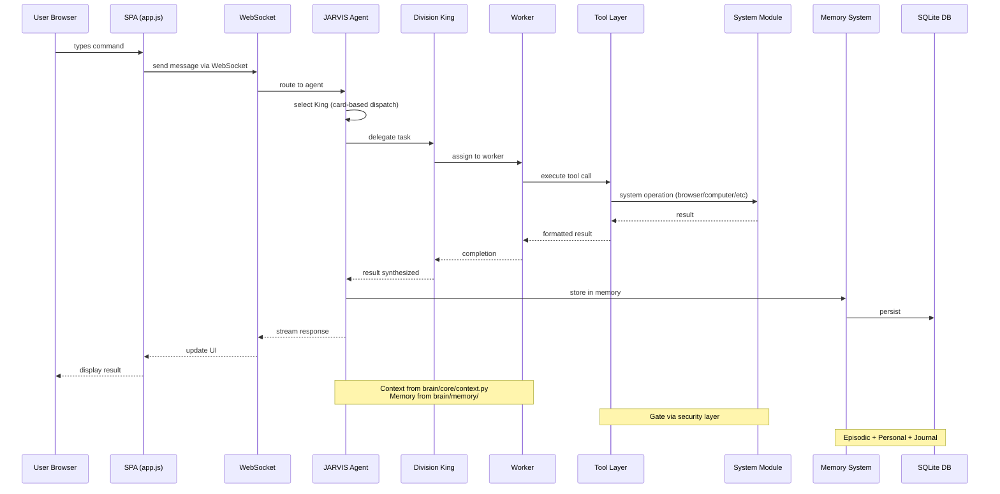
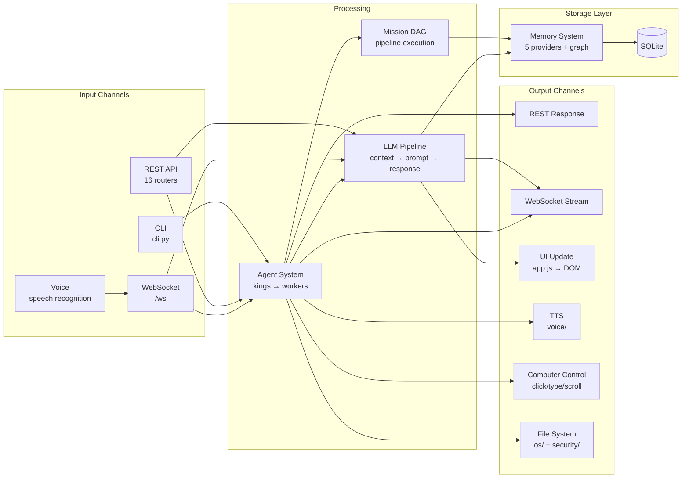
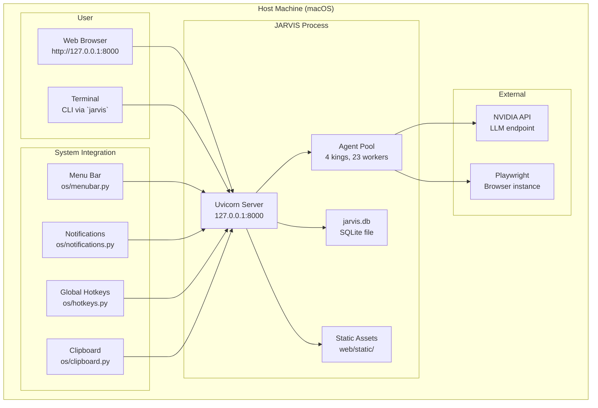

# System Dependency Map

> **Version:** 1.0.0
> **Date:** 2026-07-30
> **Base:** JARVIS v8.0.0
> **Status:** Pre-Phase 0 Analysis

---

## 1. High-Level Architecture

---

## 2. Backend Module Dependency Graph

### Legend

| Arrow | Meaning |
|-------|---------|
| `A --> B` | A imports / depends on B |
| `A -.-> B` | Weak / situational dependency |

---

## 3. Frontend Component Tree

```mermaid
graph TB
    subgraph Templates["Templates"]
        BASE["base.html
Root SPA Shell"]
    end

    subgraph CSS["Stylesheets"]
        STYLE["style.css
6,457 lines (monolithic)"]
    end

    subgraph Core["Core JS"]
        APP["app.js
Main controller, routing, state"]
        SM["state-machine.js
Application state model"]
        WS["ws-manager.js
WebSocket client"]
    end

    subgraph Features["Feature Modules"]
        CORE["jarvis-core.js🎯
Arc reactor + particle field"]
        GRAPH["graph-3d.js🎯
3D neural core visualization"]
        LIVING["living-interface.js🎯
Realtime HUD"]

        CHAT["chat-background.js🎯
3D particle chat backdrop"]
        VOICE["voice.js🎯
Speech recog + command"]

        DASH["workspace-manager.js🎯
5-pane workspace state"]

        PALETTE["command-palette.js🎯
⌘K command palette"]
        COMP["computer-control.js🎯
Screen control panel"]

        VISION["vision-experience.js🎯
Vision capture for computer"]
        VEXP["voice-experience.js🎯
Premium voice UI"]
        DT["digital-twin.js🎯
State avatar"]
        EXPLAIN["explainability.js🎯
Explanation overlay"]

        AUDIO["audio-analyzer.js🎯
Audio visualizer"]

        TIMELINE["mission-timeline.js🎯
Execution timeline"]
        DAG["mission-dag.js⚠️
DAG view (broken)"]
    end

    subgraph Dead["Dead / Orphaned JS"]
        G3D["graph3d.js✖️
Duplicate of graph-3d.js"]
        MP["mission-panel.js✖️
Dead, unused"]
        MEP["memory-panel.js✖️
Calls missing API"]
        DP["debug-patch.js✖️
Debug-only patcher"]
    end

    subgraph Pages["Page Routes"]
        HOME["/ (Home)
Home + Neural Core + command palette"]
        DASHBOARD["/dashboard
Workspace + agents + metrics"]
        SETTINGS["/settings
Config interface"]
    end

    APP --> SM
    APP --> WS
    WS --> LIVING

    HOME --> CORE
    HOME --> GRAPH
    HOME --> PALETTE
    HOME --> CHAT
    HOME --> VOICE
    HOME --> VEXP
    HOME --> AUDIO

    DASHBOARD --> DASH
    DASHBOARD --> COMP
    DASHBOARD --> VISION
    DASHBOARD --> DT
    DASHBOARD --> EXPLAIN
    DASHBOARD --> TIMELINE
    DASHBOARD --> DAG

    APP -.->|dead routes| G3D
    APP -.->|dead routes| MP
    APP -.->|dead routes| MEP
```

---

## 4. API → Backend Mapping

---

## 5. Database Schema Map

---

## 6. Memory System Architecture

---

## 7. Agent Hierarchy (Kings → Workers)

```mermaid
graph TB
    J["JARVIS Agent
jarvis.py
Chief Executive AI"]

    subgraph ENG["👑 Engineering King
kings/engineering_king.py"]
        EA["♠Q Architect Worker"]
        EB["♠J Backend Worker"]
        EF["♠10 Frontend Worker"]
        ER["♠9 React Worker"]
        EP["♠8 Python Worker"]
        ET["♠7 Testing Worker"]
        ED["♠6 Docs Worker"]
        EA11["♠5 A11y Worker"]
    end

    subgraph PER["👑 Personal King
kings/personal_king.py"]
        PC["♥Q Calendar Worker"]
        PE["♥J Email Worker"]
        PT["♥10 Tasks Worker"]
        PS["♥9 Scheduling Worker"]
    end

    subgraph RES["👑 Research King
kings/research_king.py"]
        RW["♦Q Web Research Worker"]
        RD["♦J Documentation Worker"]
        RF["♦10 Fact Check Worker"]
    end

    subgraph SYS["👑 System King
kings/system_king.py"]
        SF["♣Q Files Worker"]
        ST["♣J Terminal Worker"]
        SA["♣10 Applications Worker"]
    end

    J --> ENG
    J --> PER
    J --> RES
    J --> SYS

    ENG --> EA
    ENG --> EB
    ENG --> EF
    ENG --> ER
    ENG --> EP
    ENG --> ET
    ENG --> ED
    ENG --> EA11

    PER --> PC
    PER --> PE
    PER --> PT
    PER --> PS

    RES --> RW
    RES --> RD
    RES --> RF

    SYS --> SF
    SYS --> ST
    SYS --> SA
```

---

## 8. Event Flow

---

## 9. Data Flow Architecture

---

## 10. Deployment Architecture

